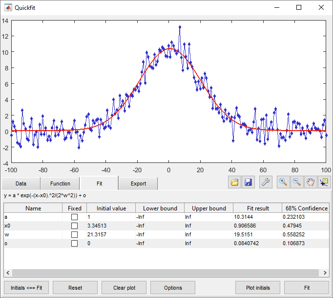

# Quickfit
Graphical user interface for nonlinear curve fitting in Matlab



# Introduction
Quickfit is a graphical tool to ease the process of curve fitting in Matlab. Simply specify `x` and `y` data, choose or type in a fit function, and perform the fit with visual feedback of initial conditions and results.

Under the hood, quickfit uses fitting algorithms from either the Statistics Toolbox, the Optimization toolbox, or plain Matlab, depending on which is installed. Thus, even without any toolboxes fits can be performed. If the Statistics toolbox is available, quickfit will also calculate 68%-confidence intervals on the fit parameters.

# Installation
Quickfit can be installed as a Matlab app by simply running the quickfit.mlappinstall file. Alternatively, you can copy the files from the source directory to any location that is in the Matlab search path.

# Usage
Start quickfit either through the quickfit icon in the Matlab apps toolbar, or by running the command:

```
quickfit
```

This will launch an empty quickfit window. Alternatively, you can give the data directly on the command line:

```
quickfit(x,y)
```

`x` and `y` must always be equal-length vectors.

If there are varying uncertainties associated with the data points, these can be entered via the `ystd` field or using the command:

```
quickfit(x,y,ystd)
```

`ystd` must be a vector of equal length as `x` and `y`, and should be proportional to the standard deviation or confidence interval of the `y` data. `ystd` will be used to perform a weighted fit. If all datapoints have the same confidence interval, there is no need to enter `ystd`.

# Defining fit functions
Fit functions can be entered as text in the Equation field of the Function tab. Additionally, you must specify the variable names used and a vector of default initial values. The New, Save, Save As and Delete buttons can be used to store and edit the function library, which is stored automatically on disk.

# About the code
Quickfit uses a custom user interface framework `cfw`, which is included in the distribution. `cfw` is an object-oriented wrapper around the matlab GUI objects, and makes it easy to define resizable layouts in a grid system. `cfw` is located in the +cwf package directory, and also includes a system to manage the settings and state of the program. Any fields in the main program are linked to a settings object, with automatic updating in both directions. The settings editor allows direct access to all settings (including program state) if needed.

The main program, in the +quickfit package directory, is fairly compact since much of the tedious work is taken care of by the +cfw package.
